<div align="center">



<br>

[](https://sherifrahim.github.io/portfolio/)
[](https://www.linkedin.com/in/sherifrahim)
[](https://medium.com/@sherifrahim)
[](https://sherifrahim.github.io/portfolio/#contact)

</div>

---

## 👋 About

I'm a **SOC & Security Engineer** based in **Abu Dhabi**, building and operating enterprise and government SOC environments on the **Microsoft security stack** — Sentinel, Defender XDR and Entra ID — across Azure and hybrid estates.

I like the engineering half of security: onboarding log sources properly, writing **KQL** that holds up in production, and tuning noise out of the pipeline so analysts spend their time on the alerts that matter. A background in penetration testing keeps the attacker's view in every detection I write.

### 📈 Impact, in numbers

| | |
| :-- | :-- |
| ⏱️ **4 days** | Critical infrastructure onboarded against a **10-day** scope |
| 💸 **30–40%** | Monthly log-ingestion reduction across client tenants — detection coverage intact |
| ✅ **Zero** | Post-deployment rework on a full government SOC build |

### 🔭 Right now

- 🛡️ Engineering SOCs and detection content at **Ansen Technologies** (multi-client, SLA-driven)
- 📚 Studying for **SC-500** (Azure Security Engineer) and **SC-401** (Information Security Administrator)
- 🧪 Building [**TFII**](https://github.com/sherifrahim/TFII), [**CertPrep**](https://github.com/sherifrahim/CertPrep) and [**Kestrel**](https://github.com/sherifrahim/kestrel) in the open

---

## 🚀 Featured projects

| Project | What it is | Stack |
| :-- | :-- | :-- |
| [**TFII**](https://github.com/sherifrahim/TFII) | Self-hosted threat-intel workspace that pulls public feeds and CVE data into one place and **shows its reasoning** — corroborated confidence, honest geolocation, bulk IOC triage, STIX 2.1 / TAXII 2.1, CISA KEV + EPSS. | `Python` `FastAPI` `React` `PostgreSQL` `Docker` |
| [**CertPrep**](https://github.com/sherifrahim/CertPrep) | Exam prep for **SC-200 / SC-401 / SC-500** with a **simulated Defender XDR + Sentinel + Azure lab** — a real KQL engine and a full intrusion hidden in the telemetry. 534 tests. | `Next.js` `Tailwind` `Prisma` `Postgres` |
| [**Sentinel Workbooks**](https://github.com/sherifrahim/Sentinel-Workbooks) | Weekly SOC reporting workbook: incident trend, ingestion volume & cost, top log sources, MITRE tactic coverage, blocked IPs, failed-login leaders. | `Sentinel` `KQL` `Azure Workbooks` |
| [**Kestrel**](https://github.com/sherifrahim/kestrel) | Tasker-grade automation & Modes for any Android phone. Turns Shizuku's perishable shell authority into **permanent grants that survive reboots**. | `Kotlin` `Compose` `Shizuku` |
| [**GetFit**](https://github.com/sherifrahim/GetFitPro) | 100% offline, no-account Android workout tracker with a 1,300+ exercise library. | `Kotlin` `Jetpack Compose` `Room` |
| [**Neoteric OS**](https://github.com/Neoteric-OS) | Minimal custom Android ROM focused on UI/UX and performance — AOSP-level device bring-up, vendor/hardware layers and framework forks. | `AOSP` `C++` `SELinux` |

---

## 🧰 Toolkit

**SIEM & detection**


**Endpoint, identity & cloud**


**Threat intel, IR & vulnerability management**


**Offensive security**


**Build**


---

## 🏅 Certifications

| Certification | Status |
| :-- | :-- |
| **SC-200** — Microsoft Security Operations Analyst Associate |  |
| **CompTIA Security+** (SY0-701) |  |
| **SC-900** — Microsoft Security, Compliance and Identity Fundamentals |  |
| **CPT** — Certified Penetration Tester (Ehackify) |  |
| **SC-500** — Microsoft Azure Security Engineer |  |
| **SC-401** — Microsoft Information Security Administrator Associate |  |

---

<details>
<summary><b>🔎 A query I'd actually ship — brute force followed by a successful sign-in (T1110)</b></summary>

```kusto
let successWindow = 1h;
let failures =
    SigninLogs
    | where TimeGenerated > ago(24h)
    | where ResultType in ("50126", "50053", "50057")
    | summarize FailedCount = count(), FirstFail = min(TimeGenerated)
        by UserPrincipalName, IPAddress
    | where FailedCount >= 10;
failures
| join kind=inner (
    SigninLogs
    | where TimeGenerated > ago(24h)
    | where ResultType == 0
    | project SuccessTime = TimeGenerated, UserPrincipalName, IPAddress, AppDisplayName
) on UserPrincipalName, IPAddress
| where SuccessTime between (FirstFail .. (FirstFail + successWindow))
| project UserPrincipalName, IPAddress, FailedCount, SuccessTime, AppDisplayName
```

More like this, with the full story, on the [portfolio](https://sherifrahim.github.io/portfolio/#detection).

</details>

<div align="center">

<sub>Want to compare notes on Sentinel, KQL or detection engineering? <a href="https://sherifrahim.github.io/portfolio/#contact">Say hello from the portfolio.</a></sub>

</div>
